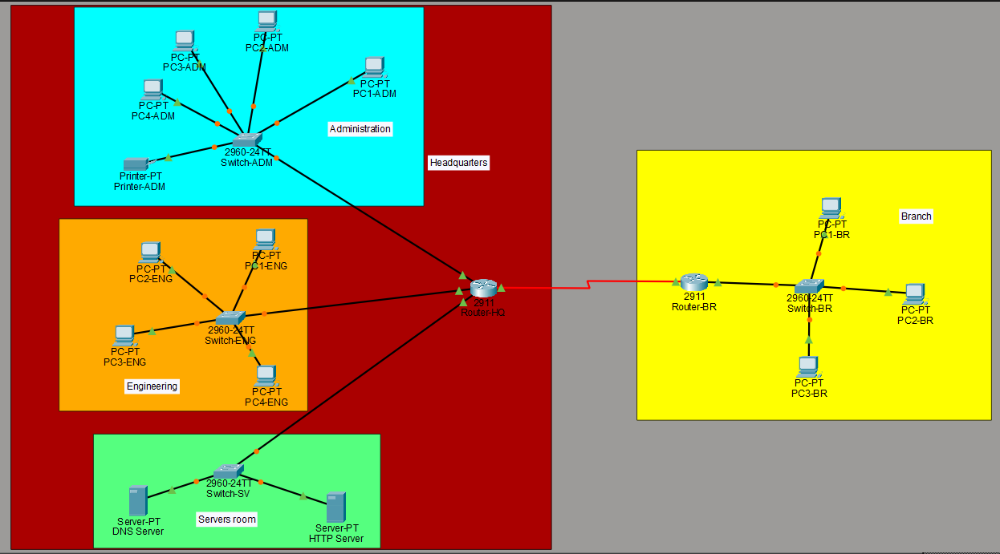

# CCNA ITN Dual-Stack Enterprise Network


## Project overview

This project simulates the network of a small company with a main office and a remote branch.

The network was designed and configured in Cisco Packet Tracer after completing the Cisco Networking Academy **Introduction to Networks (ITN)** course.

The main goal was to apply fundamental networking concepts in a practical environment, including:

- IPv4 and IPv6 addressing;
- communication between different networks;
- automatic IP address assignment;
- DNS name resolution;
- web services;
- static routing;
- basic device configuration;
- connectivity testing;
- network troubleshooting.

The final network allows computers from different departments and locations to communicate using both IPv4 and IPv6.

---

## Network scenario

The fictional company has two locations:

- **Headquarters**, containing Administration, Engineering and Server areas;
- **Remote Branch**, connected to the headquarters through a router-to-router link.

Each area uses its own network. Routers are responsible for forwarding traffic between these different networks.

---

## Network topology



The network contains:

| Device type          | Quantity |
|:---------------------|---------:|
| Routers              |    2     |
| Switches             |    4     |
| Computers            |   11     |
| Servers              |    2     |
| Network printers     |    1     |
| **Total devices**    |  **20**  |

---

## Network areas

### Administration

The Administration area contains:

- 1 Cisco 2960 switch;
- 4 computers;
- 1 network printer.

This area represents employees working in management, accounting or administrative tasks.

### Engineering

The Engineering area contains:

- 1 Cisco 2960 switch;
- 4 computers.

This area represents technical employees working in engineering or software-related tasks.

### Server room

The server area contains:

- 1 Cisco 2960 switch;
- 1 DNS and HTTP server;
- 1 DHCP server.

The servers provide network services to computers located in both the headquarters and the remote branch.

### Remote branch

The remote branch contains:

- 1 router;
- 1 Cisco 2960 switch;
- 3 computers;

The branch communicates with the headquarters through a connection between the two routers.

---

## How the network works

### Switches

Switches connect devices located in the same area.

For example, the Administration switch connects the Administration computers and printer to the headquarters router.

### Routers

Routers connect different networks.

The headquarters router connects:

- Administration;
- Engineering;
- Servers;
- Remote branch.

The branch router connects the remote office to the headquarters.

### DHCP

DHCP automatically provides IPv4 configuration to the computers, including:

- IPv4 address;
- subnet mask;
- default gateway;
- DNS server address.

This avoids manually configuring every computer.

### IPv6 Auto Configuration

Computers use IPv6 automatic configuration, also known as SLAAC.

The routers advertise the IPv6 network prefix, allowing computers to automatically generate their own IPv6 addresses and learn the correct default gateway.

### DNS

DNS stands for **Domain Name System**.

Computers communicate using IP addresses, but IP addresses are difficult for users to remember. DNS solves this problem by translating a readable name into the corresponding IP address.

In this project, users can access the internal website using:

```text
www.network.local